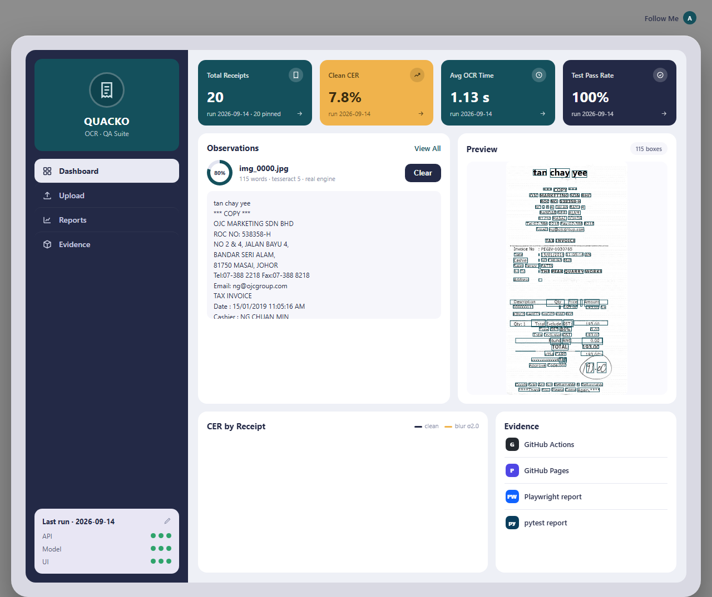
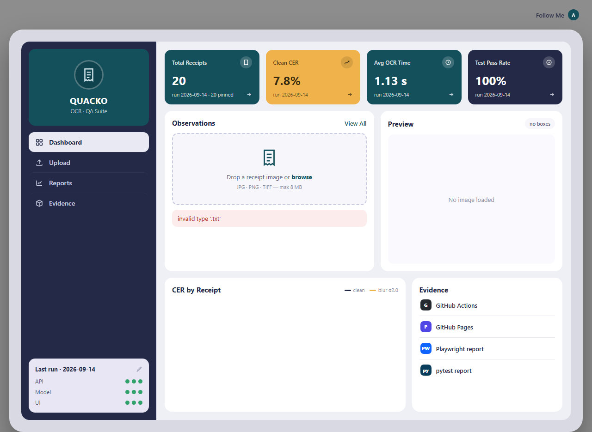
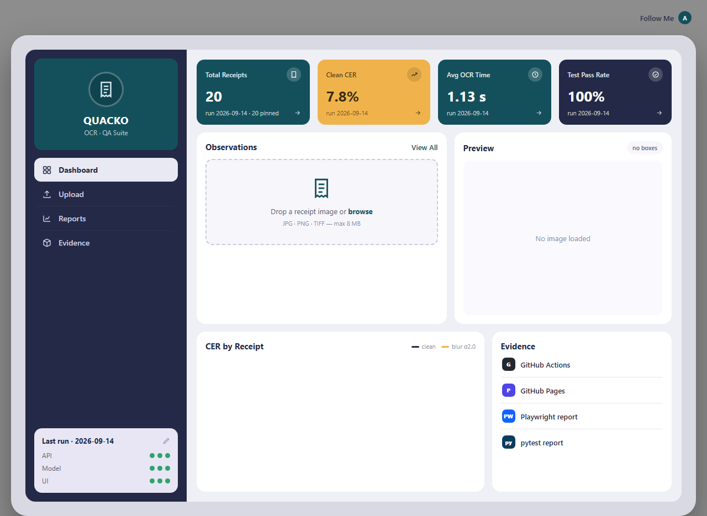
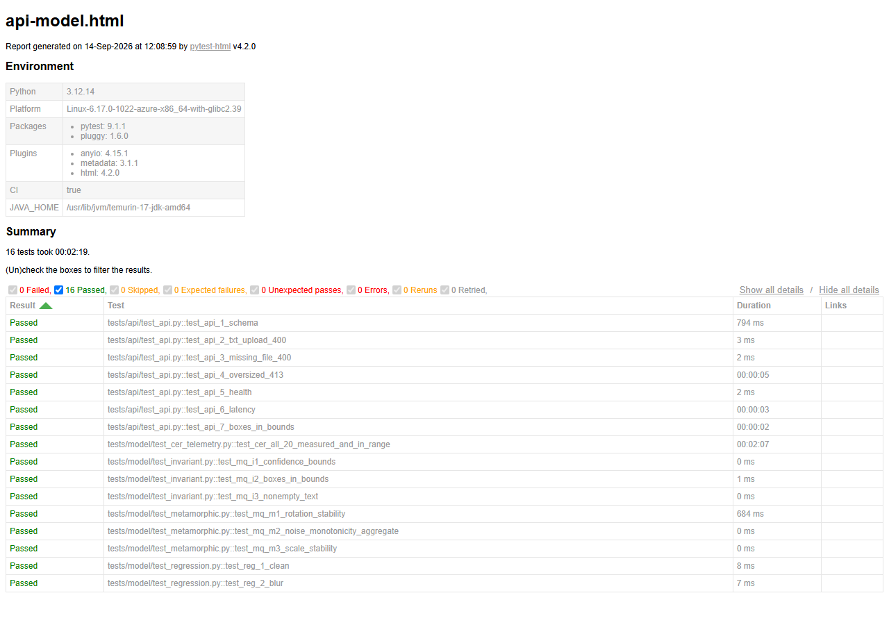
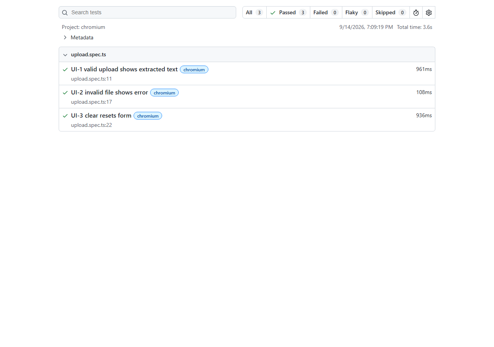
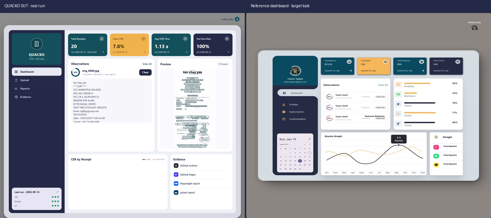

# QUACKO

[](https://github.com/AKARandy/QUACKO/actions/workflows/ci.yml)
[](https://github.com/AKARandy/QUACKO/actions/workflows/deploy.yml)

QA suite for an OCR service that reads photographed receipts. A small Flask
app runs receipt images through Tesseract; pytest and Playwright suites cover
the API, recognition quality under image degradation (blur, rotation, noise,
upscale), and the dashboard UI. Tests run in GitHub Actions on every PR and
every push to main, and the reports publish to the evidence site.

Test data is 20 real photographed receipts, hash-pinned in the repo and
transformed in memory. Nothing is generated.

**Stack:** Python · Flask · Tesseract OCR · OpenCV · pytest · Playwright ·
GitHub Actions · MkDocs Material

**Evidence site:** https://akarandy.github.io/QUACKO/

## Proof

The dashboard, empty before any upload:


A real receipt through the real engine: extracted text, confidence ring, and
word boxes drawn over the preview:



Uploading a non-image shows the API's actual error, no crash:



Clear resets everything back to the empty state:



The pytest report from CI: 16/16 API and model tests green:



The Playwright report from CI: 3/3 browser tests green:



The dashboard next to the reference design it was built to match:



## Layout

- `app/`: the Flask OCR service (`POST /api/ocr`, `GET /health`, dashboard page)
- `tests/api/` · `tests/model/`: pytest suites (contract, invariants, degradation, regression)
- `tests/ui/`: Playwright specs
- `data/golden/`: the 20 pinned receipts, labels, hashes
- `data/baselines/`: committed accuracy baselines, one per environment
- `docs/`: test strategy, quality gates, failure gallery, screenshots
- `scripts/`: calibration, run logging, gallery generation

## Clone

```powershell
git clone https://github.com/AKARandy/QUACKO.git
cd QUACKO
```

## Use (local)

```powershell
python -m venv .venv
.venv\Scripts\pip install -r requirements.txt
.venv\Scripts\python app\main.py                 # service on :5000 (needs Tesseract 5 on PATH)
.venv\Scripts\python -m pytest tests\api tests\model -v
cd tests\ui; npm ci; npx playwright install chromium; npx playwright test
```

`data/golden/` is committed, so a fresh clone already has the test images
(hashes are re-verified every run).
