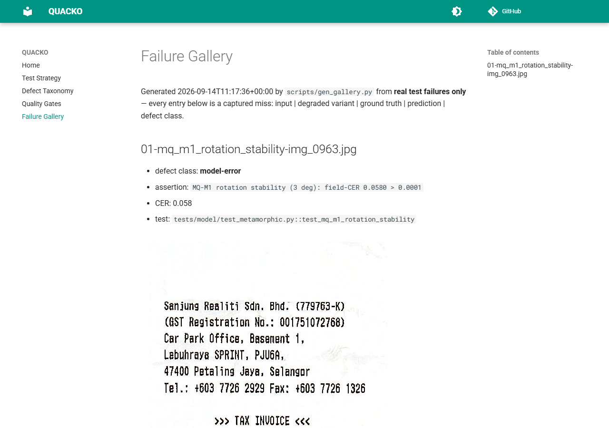

  <h1 class="text-3xl font-bold tracking-widest">QUACKO</h1>
  
QA dashboard for a Tesseract OCR receipt reader. Every widget below is fed by the latest logged CI run.

  

    API CONTRACT: LOADING
    MODEL GATES: LOADING
    UI SUITE: LOADING
    CER TELEMETRY: LOADING
  

  

    

      
--

      
Total receipts

    

    

      
--

      
Clean CER mean

    

    

      
--

      
Blur CER mean

    

    

      
--

      
Regression status

    

  

  
Loading run data...

  

    <h2 class="text-xl font-bold mb-4">Clean vs blur CER per receipt</h2>
    
<canvas id="cer-chart"></canvas>

    
Field-CER per receipt (percent). CER is telemetry: measured and shown, never a pass/fail gate.

  

  <h2 class="text-xl font-bold mt-10 mb-4">Screenshot proof (real runs)</h2>
  

    <figure class="bg-slate-800 border border-slate-700 rounded-xl overflow-hidden md:col-span-2">
      
      <figcaption class="p-4 text-sm text-slate-400">Hero: a real receipt through the real engine (text, confidence, word boxes).</figcaption>
    </figure>
    <figure class="bg-slate-800 border border-slate-700 rounded-xl overflow-hidden">
      
      <figcaption class="p-4 text-sm text-slate-400">Empty dashboard before upload.</figcaption>
    </figure>
    <figure class="bg-slate-800 border border-slate-700 rounded-xl overflow-hidden">
      
      <figcaption class="p-4 text-sm text-slate-400">Invalid upload shows the real API error.</figcaption>
    </figure>
    <figure class="bg-slate-800 border border-slate-700 rounded-xl overflow-hidden">
      
      <figcaption class="p-4 text-sm text-slate-400">Clear resets to the empty state.</figcaption>
    </figure>
    <figure class="bg-slate-800 border border-slate-700 rounded-xl overflow-hidden">
      
      <figcaption class="p-4 text-sm text-slate-400">CI pytest report: 16/16 green.</figcaption>
    </figure>
    <figure class="bg-slate-800 border border-slate-700 rounded-xl overflow-hidden">
      
      <figcaption class="p-4 text-sm text-slate-400">CI Playwright report: 3/3 green.</figcaption>
    </figure>
    <figure class="bg-slate-800 border border-slate-700 rounded-xl overflow-hidden">
      
      <figcaption class="p-4 text-sm text-slate-400">Dashboard next to the reference design it matches.</figcaption>
    </figure>
    <figure class="bg-slate-800 border border-slate-700 rounded-xl overflow-hidden">
      
      <figcaption class="p-4 text-sm text-slate-400">Gallery self-test: a forced miss, captured and rendered, then restored to green.</figcaption>
    </figure>
  

  

    <a href="failure-gallery/" class="border border-slate-700 rounded-full px-4 py-2 text-sm text-teal-300">Failure gallery</a>
    <a href="reports/api-model.html" class="border border-slate-700 rounded-full px-4 py-2 text-sm text-teal-300">pytest report</a>
    <a href="reports/ui-report/" class="border border-slate-700 rounded-full px-4 py-2 text-sm text-teal-300">Playwright report</a>
    <a href="https://github.com/AKARandy/QUACKO/actions" class="border border-slate-700 rounded-full px-4 py-2 text-sm text-teal-300">Actions</a>
    <a href="https://github.com/AKARandy/QUACKO" class="border border-slate-700 rounded-full px-4 py-2 text-sm text-teal-300">Repository</a>
    <a href="test-strategy/" class="border border-slate-700 rounded-full px-4 py-2 text-sm text-teal-300">Test strategy</a>
    <a href="quality-gates/" class="border border-slate-700 rounded-full px-4 py-2 text-sm text-teal-300">Quality gates</a>
  

